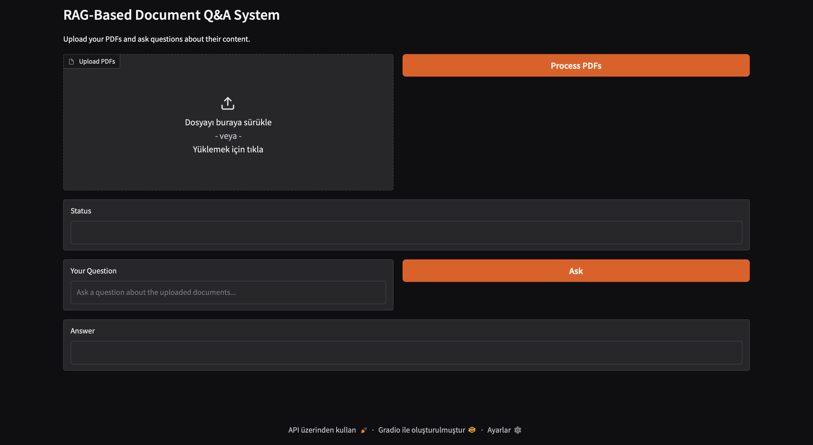

# RAG Document Q&A Service

A production-style retrieval-augmented generation (RAG) service for
source-attributed question answering over PDF documents. Built with LangChain,
FAISS, and Google Gemini, served behind a FastAPI API, and shipped with
experiment tracking, monitoring, tests, and CI.



---

## Overview

The service ingests PDFs, builds a FAISS vector index over Gemini embeddings, and
answers natural-language questions using only the retrieved context, returning
the source document and page for every answer. Beyond the core pipeline, it is
wrapped as a real service: a FastAPI API with request validation, RAGAS-based
evaluation, MLflow experiment tracking, Prometheus and Grafana monitoring, a
pytest suite, and a GitHub Actions CI pipeline.

---

## Features

- **Source-attributed answers.** Every response includes the originating
  document and page; the prompt is constrained to answer only from retrieved
  context and to say so when the answer is not present.
- **Configurable retrieval.** Chunk size, chunk overlap, and top-k are
  parameters, so retrieval behaviour can be tuned and compared.
- **FastAPI service.** Typed endpoints with Pydantic validation, a vector store
  loaded once at startup, and a Gradio UI mounted on the same app.
- **Evaluation harness.** RAGAS faithfulness and answer-relevancy scoring across
  retrieval configurations.
- **Experiment tracking.** MLflow logs retrieval parameters, latency, and
  evaluation metrics for every run.
- **Monitoring.** The API exposes Prometheus metrics, Prometheus scrapes them,
  and Grafana is included in the stack for building dashboards over them.
- **Tested and CI-backed.** pytest covers the API contracts and error paths;
  GitHub Actions runs the tests and builds the Docker image on every push.

---

## Architecture

The stack runs as four services via Docker Compose:

| Service     | Role                                              | Port |
| ----------- | ------------------------------------------------- | ---- |
| api         | FastAPI app (RAG pipeline, REST API, Gradio UI)   | 8000 |
| mlflow      | MLflow tracking server (SQLite backend store)     | 5001 |
| prometheus  | Scrapes API metrics                               | 9090 |
| grafana     | Dashboards over Prometheus                        | 3000 |


---

## Pipeline

1. PDFs are loaded and split into chunks with a recursive character splitter.
2. Chunks are embedded with Gemini embeddings and stored in a FAISS index.
3. A query retrieves the top-k chunks, which are passed to Gemini under a strict
   context-grounded prompt.
4. The answer is returned with its source documents and pages, and the run is
   logged to MLflow.

---

## API

| Method | Endpoint   | Description                                            |
| ------ | ---------- | ----------------------------------------------------- |
| GET    | `/health`  | Service status and whether the vector store is loaded |
| POST   | `/ingest`  | Build the index from PDFs (configurable chunking)     |
| POST   | `/query`   | Ask a question; returns answer, sources, and latency  |
| GET    | `/metrics` | Prometheus metrics                                    |
| GET    | `/ui`      | Gradio interface                                      |

Example query:

```bash
curl -X POST http://localhost:8000/query \
  -H "Content-Type: application/json" \
  -d '{"question": "What dataset was used for training?", "k": 7}'
```

---

## Evaluation

`evaluation.py` runs a RAGAS evaluation over a set of test questions, sweeping
chunk-size, overlap, and top-k configurations and logging the results to MLflow.

| Metric           | Score |
| ---------------- | ----- |
| Faithfulness     | 0.96  |
| Answer relevancy | 0.81  |


```bash
python evaluation.py
```

---

## Running

### With Docker Compose

```bash
cp .env.example .env        # add your GOOGLE_API_KEY
docker compose up --build
```

This starts the API, MLflow, Prometheus, and Grafana. The API is available at
`http://localhost:8000` (UI at `/ui`), MLflow at `http://localhost:5001`, and
Grafana at `http://localhost:3000`.

### Local development

```bash
python -m venv venv
source venv/bin/activate      # Windows: venv\Scripts\activate
pip install -r requirements.txt

cp .env.example .env          # add your GOOGLE_API_KEY
uvicorn api:app --reload --port 8000
```

---

## Testing and CI

```bash
PYTHONPATH=. pytest tests/ -v
```

GitHub Actions runs the test suite on every push and pull request to `main`, and
builds the Docker image once tests pass.

---

## Tech stack

LangChain, FAISS, Google Gemini (gemini-2.5-flash-lite and gemini-embedding-001), FastAPI, Gradio, Pydantic,
RAGAS, MLflow, Prometheus, Grafana, Docker and Docker Compose, GitHub Actions,
pytest.

---

## Configuration

Create a `.env` file from `.env.example`:

```
GOOGLE_API_KEY=your_api_key_here
```

Get an API key from Google AI Studio.